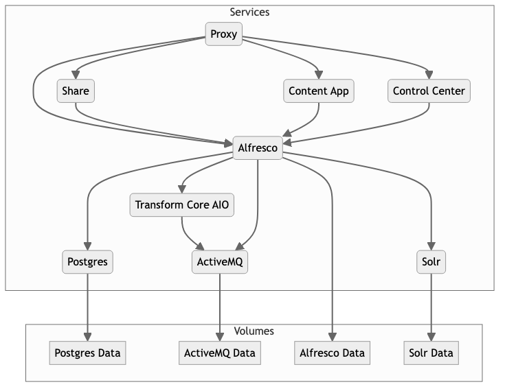

# Alfresco Docker Compose Best Practices

Alfresco Platform provides flexibility in deployment, accommodating various infrastructures and operational preferences. 

Below are several deployment approaches:

**[ZIP Distribution files](https://docs.alfresco.com/content-services/latest/install/zip/)**

Deploying Alfresco using ZIP distribution files involves manually configuring and installing Alfresco on servers. This approach allows for detailed customization of the installation process, making it suitable for environments where specific configurations or integrations are required.

**[Ansible](https://docs.alfresco.com/content-services/latest/install/ansible/)**

Ansible automation simplifies the deployment and management of Alfresco across multiple servers. Ansible playbooks automate the installation and configuration tasks, ensuring consistency and reducing deployment time. This method is ideal for environments requiring rapid deployment and scalability.

**[Containers](https://docs.alfresco.com/content-services/latest/install/containers/)**

Containerization of Alfresco leverages Docker and Kubernetes technologies, offering a modern approach to deployment:

   - **[Docker Compose](https://docs.alfresco.com/content-services/latest/install/containers/docker-compose/)**: Docker Compose simplifies the orchestration of multiple Alfresco services, such as Alfresco Content Repository, ActiveMQ, Elasticsearch, and others, defined in a single YAML file. It facilitates deployment in development, testing, and small-scale production environments.

   - **[Helm](https://docs.alfresco.com/content-services/latest/install/containers/helm/)**: Helm charts streamline the deployment of Alfresco on Kubernetes clusters. Helm manages Kubernetes applications through easy-to-use templates (charts) and package management. It enables scalability, version control, and rollback capabilities, making it suitable for production-grade deployments.

This project provides a sample **Docker Compose** configuration designed to apply *best practices* for deploying the Alfresco Platform in production environments:

- Dependencies for service startup are clearly defined using `healthcheck` and `depends_on` clauses
- Resource limits and reservations are appropriately configured for each service using `deploy` clause
- Sensitive information is managed in a separate file (such as `.env`)
- Persistent volumes are configured to ensure reliable storage

## Contents

The project includes two Docker Compose templates:

- [community](community) folder provides a `compose.yaml` file to deploy Alfresco Community 23.2



- [enterprise](enterprise) folder provides a `compose.yaml` file to deploy Alfresco Enterprise 23.2
  - Docker Images from [quay.io](https://quay.io/organization/alfresco) are used, since this product is only available for Alfresco Enterprise customers. If you are Enterprise Customer or Partner but you are still experimenting problems to download Docker Images, contact [Alfresco Hyland Support](https://community.hyland.com) in order to get required credentials and permissions.

  

## Basic Operations with Docker Compose

>> Ensure you are in the correct folder (either 'community' or 'enterprise') before executing the following commands.

### Starting the Docker Compose Environment

To start the Docker Compose environment defined in `compose.yaml` file, use the following command:
```bash
docker compose up -d
```
- `-d` flag runs containers in the background (detached mode), but they can also be run in foreground mode by omitting this flag.

### Stopping the Docker Compose Environment

To stop the Docker Compose environment and all its running containers, use:
```bash
docker compose down
```
- This command stops containers and removes containers and networks created by `docker compose up`.

### Removing Volumes

To remove volumes associated with the Docker Compose environment, add the `-v` flag to the `down` command:
```bash
docker compose down -v
```
- This command stops containers, removes containers, networks, and volumes created by `docker compose up`.

### Adjusting Resources (CPU and Memory)
In your `compose.yml`, resource limits and reservations are defined under the `deploy` section for each service. To adjust these resources:
- Modify the `limits` and `reservations` for each service as needed.

**Example**
If you want to adjust resources for a service like `alfresco`, you can edit the `deploy` section in `compose.yaml`:
```yaml
services:
  alfresco:
    ...
    deploy:
      resources:
        limits:
          cpus: '2'
          memory: 4g  # Increase memory limit to 4 GB
        reservations:
          cpus: '1'
          memory: 2g  # Increase memory reservation to 2 GB
```
- After modifying resource settings, restart the Docker Compose environment to apply changes:
  ```bash
  docker compose up -d
  ```

### Changing Docker Volumes to Local Volumes

By default, Docker Compose uses Docker-managed volumes. To switch to local volumes where host directories are mounted into containers, modify your `compose.yaml`

Replace Docker volume definitions like `- volume_name:/path/in/container` with local paths on the host machine, ensuring permissions are set correctly:

```yaml
services:
  postgres:
    ...
    volumes:
      - /path/on/host:/var/lib/postgresql/data  # Example of using a local volume instead of Docker volume
```      

Ensure that the directory `/path/on/host` on the host machine has appropriate permissions for the Docker containers to read and write data.

### Additional Operations

**Viewing Logs**
To view logs from all containers managed by Docker Compose:
```bash
docker-compose logs
```

**Checking Status of Services**
To check the status of services managed by Docker Compose:
```bash
docker-compose ps
```

**Scaling Services**
If configured in `compose.yaml`, you can scale services:
```bash
docker-compose up -d --scale SERVICE=NUM
```
Replace `SERVICE` with the service name and `NUM` with the number of instances.